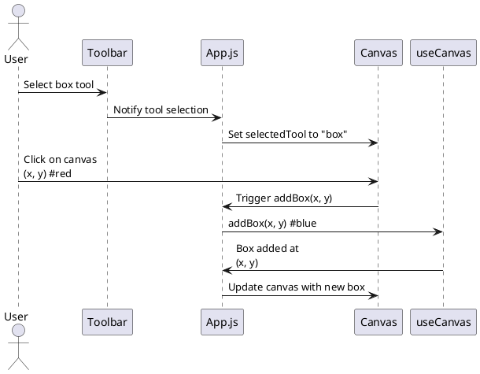
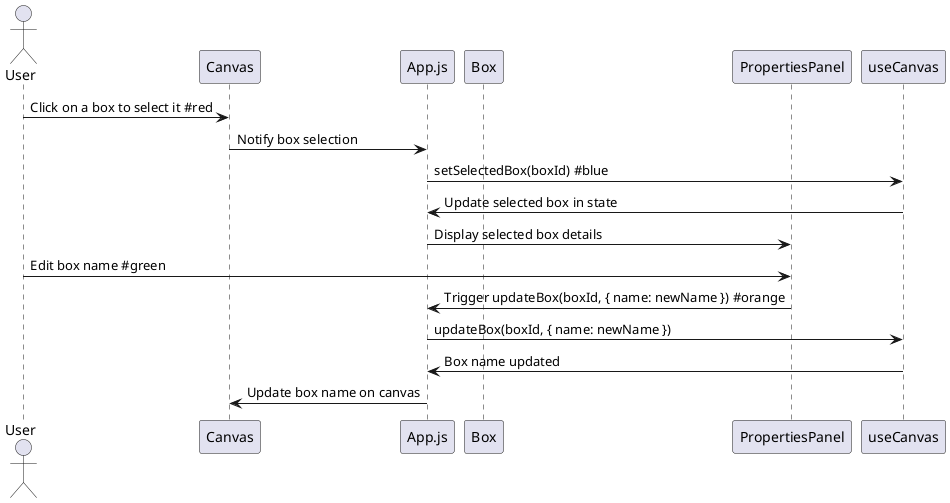
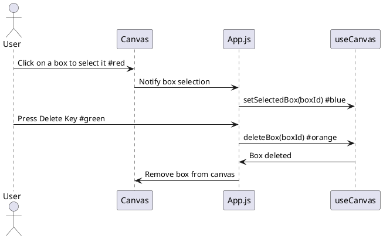
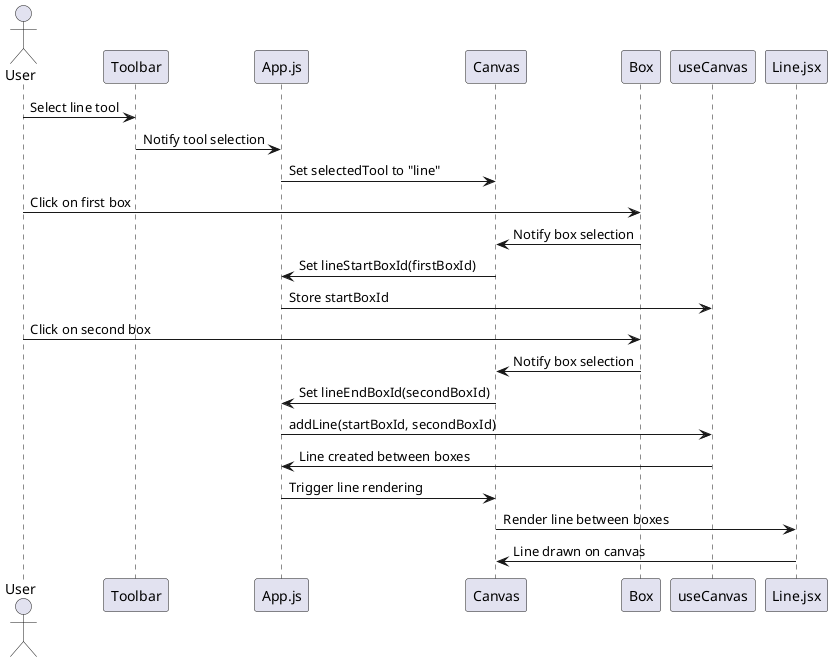

# Box Link Editor

Simple web application for creating and linking boxes with lines.

## Setup

1. Clone the repository.   
2. Run `cd componenteditor`   
2. Run `npm install` to install dependencies.
3. Run `npm run dev` to start the development server.

## With Docker
To dockerize the app:   
docker build -t componenteditor .   
docker run -d -it -p 5019:3000 --restart unless-stopped --name componenteditor-app componenteditor

## Usage

- Double-click on a box to edit its name.
- Click and drag the small circle at the bottom right of a box to start drawing a line to another box.
- The lines represent relationships between the boxes.

## Sequence Diagram

### Create Box

### Edit property of Box

### Delete Box

### Create Line
